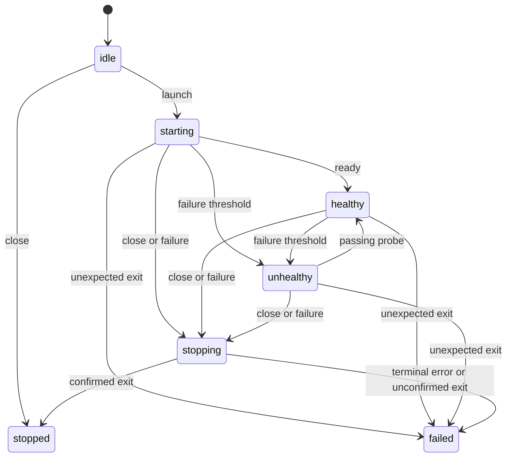

# Architecture and tradeoffs

## Ownership

One supervisor owns one ChildProcess handle. It cannot attach to an existing PID, restart a process, or manage a fleet. The process is created with Node's spawn API, shell disabled, detached disabled, hidden windows on Windows, and ignored stdio. No logs or output buffers grow with the child.

The package entrypoint exposes the supervisor, its public types, and a small error taxonomy. The internal runtime interface supplies a clock and spawn implementation for tests; it is not a supported package export. There is no singleton and no process-wide exception or signal handler.

## State machine

Stopped and failed are terminal. Startup's deadline remains active until the first healthy result, even if repeated failed probes have already marked the session unhealthy.

A direct exit outside stopping is unexpected, including exit code zero. If a shutdown request is processed before the exit notification, it is classified as a shutdown exit. This is an event-ordering contract, not an attempt to infer the child's intent.

State transitions are checked against an explicit adjacency table. A transition commits before notifying the observer. Reentrant close calls share the same shutdown promise.

## Deadlines and cancellation

The clock is used for bounded timers rather than an interval loop. Each successful or failed health callback schedules the next check only after it settles. Failure counts saturate at the configured threshold.

A deadline settles the library's wait and aborts the callback signal. It cannot terminate JavaScript. A timed-out health check ends supervision, so an abandoned callback is never followed by an overlapping probe. Late completion and rejection handlers remain attached and cannot revive a terminal session.

One consumer operation is admitted at a time. This bounds supervisor-owned work without adding a queue. An operation timeout or cancellation closes the session, preventing replacement work from accumulating behind a callback that ignores cancellation.

Startup failure is reported promptly while cleanup proceeds. Await close in a finally block to wait for resource disposal. Total time to disposal can include both the startup deadline and the shutdown deadline.

## Shutdown

Close first prevents further work, clears scheduled probes and the startup timer, detaches the launch abort listener, and aborts active callbacks. It installs a total deadline and an escalation timer before sending SIGTERM, so even an immediate exit can safely clear both timers.

An exit confirms direct-child cleanup. Otherwise the supervisor sends SIGKILL at the grace boundary. At the total deadline it reports CleanupError, removes its timers and subscriptions, and unreferences the still-unconfirmed handle so it cannot indefinitely pin the host event loop.

The native adapter keeps one stateless error guard until the child's close event. This contains a late signal-delivery error after supervision has ended. It does not retain the supervisor, probe, environment, or command. A process that truly never exits can retain that minimal native handle and guard; reporting failure is more honest than claiming it was reaped.

No callback is restarted, no cleanup retry continues after the deadline, and no PID is used again after exit is observed.

## Limits

Only the direct child is signalled. Node documents that terminating a child does not automatically terminate its descendants, and Windows signal handling differs from POSIX. See the [Node child-process documentation](https://nodejs.org/api/child_process.html#subprocesskillsignal).

Linux and macOS can provide graceful SIGTERM handling. Windows termination through this API is abrupt. Launch an executable directly rather than a shell or a launcher that delegates to an unrelated daemon.

For stronger tree containment, the embedding application needs an OS boundary such as a Linux cgroup or Windows Job Object. Those mechanisms are outside this portable library. Nothing here guarantees cleanup after host SIGKILL, machine failure, an uninterruptible kernel task, or a blocked JavaScript event loop.

Ignoring stdio trades child output diagnostics for a simple memory and descriptor bound. Health callbacks and operations own their network connections and other resources. There is no retry framework, browser protocol implementation, or durable state.

## When another tool fits better

[Execa](https://github.com/sindresorhus/execa) is a broader process-execution library with output handling, pipelines, and termination facilities. [Puppeteer's browser launcher](https://pptr.dev/browsers-api/browsers.launch) is useful when browser discovery and launch integration are the main need.

BrowserGuard's narrower purpose is explicit readiness and health transitions around a directly owned process. It does not replace a browser automation client or an operating-system supervisor.
